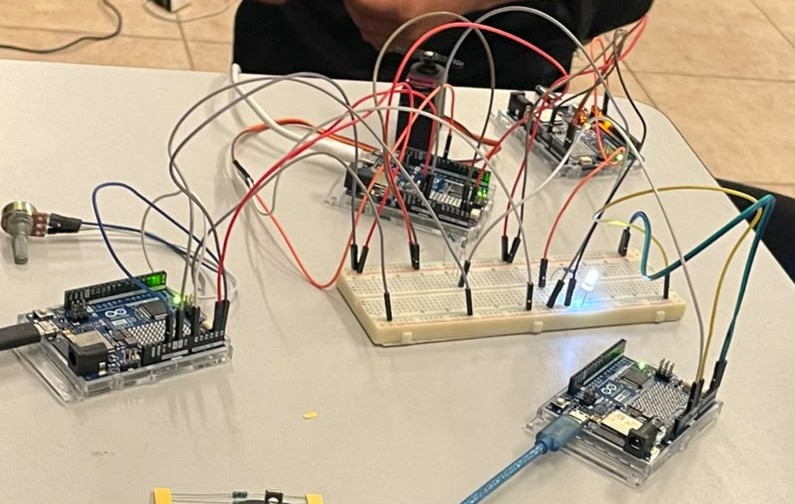

# Comunicación I2C entre 4 Arduinos

Sistema de comunicación por bus I2C entre un Arduino maestro y tres Arduinos esclavos, que comparten las líneas SDA y SCL y se identifican con direcciones distintas (0x08, 0x09 y 0x0A), simulado en Tinkercad y armado también de forma física.

## Descripción

El maestro coordina tres esclavos por I2C: uno controla un LED, otro un servomotor, y otro lee un potenciómetro. Cada 500 ms el maestro pide el valor del potenciómetro, lo convierte a un ángulo (0°–180°) y lo envía al servo. Por el Monitor serie se puede escribir 1 o 0 para controlar el LED. El maestro reporta el estado de la comunicación y avisa si algún esclavo no responde.

## Objetivos de aprendizaje

Comprender el funcionamiento del bus I2C mediante la comunicación entre un maestro y varios esclavos que comparten las mismas líneas de datos, aprendiendo a asignar direcciones distintas a cada dispositivo, a programar el envío y la recepción de datos con la librería Wire, y a detectar fallas de comunicación revisando el resultado de `endTransmission()` y `requestFrom()` en lugar de bloquear el programa.

## Herramientas y material utilizado

* 4 Arduino Uno R4 WiFi
* 1 protoboard (Breadboard Small)
* 1 LED
* 1 resistencia de 470 Ω (LED) y 2 resistencias de 4.7 kΩ (pull-up en SDA y SCL)
* 1 micro servomotor
* 1 potenciómetro
* Cables de conexión
* Librerías Wire y Servo, y Monitor serie del Arduino IDE

## Diagrama del circuito

## Montaje físico

## Código

* [Maestro.ino](https://github.com/l231000052-ops/Sistemas-programables/blob/main/Comunicaci%C3%B3n%20I2C%20entre%204%20Arduinos/Codigo/Maestro.ino)
* [Esclavo1_LED.ino](https://github.com/l231000052-ops/Sistemas-programables/blob/main/Comunicaci%C3%B3n%20I2C%20entre%204%20Arduinos/Codigo/Esclavo1(LED).ino)
* [Esclavo2_Servo.ino](https://github.com/l231000052-ops/Sistemas-programables/blob/main/Comunicaci%C3%B3n%20I2C%20entre%204%20Arduinos/Codigo/Esclavo2(servo).ino)
* [Esclavo3_Potenciometro.ino](https://github.com/l231000052-ops/Sistemas-programables/blob/main/Comunicaci%C3%B3n%20I2C%20entre%204%20Arduinos/Codigo/Esclavo3(potenciómetro).ino)

## Reporte

[Reporte.pdf](https://github.com/l231000052-ops/Sistemas-programables/blob/main/Comunicaci%C3%B3n%20I2C%20entre%204%20Arduinos/Reporte/Reporte.pdf)

## Resultados

Durante las pruebas, los tres esclavos respondieron correctamente a sus respectivas direcciones sin interferir entre sí: el LED cambió de estado al escribir 1 o 0 en el Monitor serie, el servomotor siguió de forma consistente los cambios del potenciómetro, y el maestro detectó y reportó correctamente cuando algún esclavo dejó de responder (NACK), sin bloquearse en ningún momento gracias al uso de `millis()` en lugar de `delay()`.

## Video del funcionamiento

[Ver video](https://youtu.be/xtoZlY5BY0I)

## Conclusiones

El bus I2C permite comunicar varios dispositivos usando solo dos líneas (SDA y SCL) más tierra común; agregar un esclavo no requiere pines adicionales, solo una dirección diferente. Cada esclavo debe tener una dirección única, ya que si dos comparten la misma, ambos responden a la vez y los datos se corrompen. El maestro controla la comunicación completa: decide con quién habla, cuándo y si pide o manda datos, mientras el esclavo solo responde cuando se le llama. Revisar el resultado de `endTransmission()` permite detectar cuando un esclavo no contesta (NACK) en lugar de que el sistema se congele, y usar `millis()` en vez de `delay()` en el maestro permite atender el Monitor serie y consultar el potenciómetro sin bloquearse.
