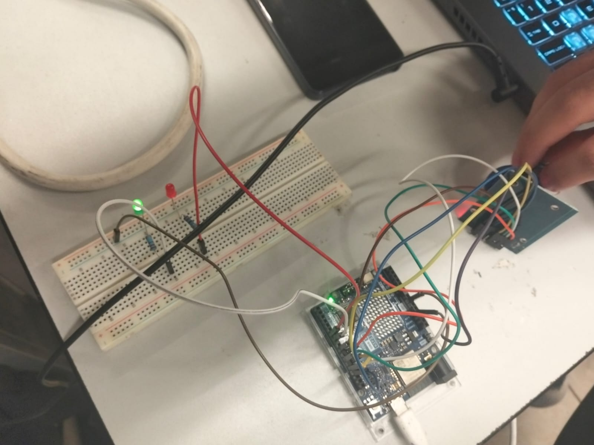

# Control de acceso con RFID por SPI

Sistema de control de acceso mediante un lector RFID RC522 comunicado por SPI con Arduino UNO R4 WiFi, que valida el UID de una tarjeta o llavero y enciende un LED verde (acceso permitido) o rojo (acceso denegado) según el resultado.

## Descripción

Este proyecto implementa un sistema de control de acceso utilizando un módulo lector RFID RC522 conectado al Arduino mediante el bus SPI. Al acercar una tarjeta o llavero RFID, el Arduino obtiene su UID y lo compara contra un UID autorizado almacenado en el código, encendiendo el LED correspondiente según el resultado. Toda la temporización de los LEDs se maneja con `millis()`, sin usar `delay()` en ningún punto del programa, para no interrumpir la lectura continua del lector.

## Objetivos de aprendizaje

Comprender el funcionamiento del protocolo de comunicación SPI (líneas SCK, MOSI, MISO y CS/SS) aplicado a un módulo lector RFID RC522, implementando la lectura y validación de UID mediante la librería MFRC522, con control de temporización no bloqueante y diagnóstico de fallas de comunicación.

## Herramientas y material utilizado

* Arduino UNO R4 WiFi
* Arduino IDE
* Módulo lector RFID RC522 (SPI)
* Tarjeta y llavero RFID de prueba
* Protoboard
* LEDs: verde (acceso permitido) y rojo (acceso denegado)
* Resistencias limitadoras de corriente (220Ω)
* Cables de conexión (jumpers)

## Diagrama del circuito

## Montaje físico

## Código

[acceso.ino](Codigo/acceso.ino)

## Reporte

[Reporte.pdf](https://github.com/l231000052-ops/Sistemas-programables/blob/main/Control%20de%20acceso%20con%20RFID%20por%20SPI/Reporte/Reporte.pdf)

## Resultados

Durante las pruebas, el lector RC522 identificó correctamente el UID de cada tarjeta acercada, encendiendo el LED verde al detectar el UID autorizado y el LED rojo ante cualquier otro UID, sin dejar de escuchar nuevas tarjetas gracias al uso de `millis()` en lugar de `delay()`. Al desconectar intencionalmente la línea MISO, el sistema detectó la falla de comunicación SPI (mediante la lectura del registro de versión del chip) y la reportó por el Monitor Serie en vez de fallar silenciosamente, validando tanto el hardware armado en protoboard como la lógica de diagnóstico implementada.

## Video del funcionamiento

[Ver video](https://youtu.be/nyH8QqpdwpU)

## Conclusiones

Esta práctica permitió comprender el funcionamiento del bus SPI y la diferencia entre sus líneas de comunicación, aplicándolo a un caso real de control de acceso con un módulo lector RFID. Se reforzó el uso de `millis()` para mantener la lectura del lector activa en todo momento, así como la importancia de diagnosticar fallas de comunicación en lugar de asumir que el hardware siempre responde correctamente.
