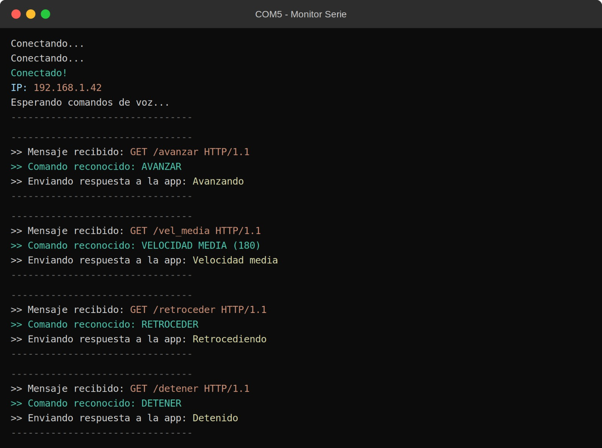

# Nombre del proyecto
Sistema de Control Remoto por Voz usando Arduino, WiFi y Reconocimiento de Voz

## Descripción
El objetivo de este proyecto es controlar de forma remota una llanta mediante comandos de voz, enviados desde una aplicación móvil hacia un Arduino conectado por WiFi, que acciona un motor DC a través de un puente H.

## Objetivos de aprendizaje
Programar y simular en Arduino el control de dirección y velocidad de un motor DC mediante un módulo controlador L298N, estableciendo comunicación inalámbrica (WiFi/HTTP) entre una aplicación móvil con reconocimiento de voz (MIT App Inventor) y la placa Arduino UNO R4 WiFi.

## Material utilizado
Enumera todos los componentes usados:

* Arduino UNO R4 WiFi
* Módulo controlador de motor L298N
* Motor DC con llanta
* Fuente de alimentación (fuente ATX / batería 9V)
* Cables Dupont
* Dispositivo móvil con app desarrollada en MIT App Inventor

## Diagrama del circuito

## Código
[llanta.ino](Codigo/llanta.ino)

## Video del funcionamiento
[Ver video en YouTube](https://www.youtube.com/watch?v=9R7mMfCSUC4)

## Evidencias de armado

## Terminal

## Reporte
Incluye: [Reporte.pdf](Reporte/Reporte.pdf)

* Diagrama de conexión y explicación del circuito
* Código comentado y su funcionamiento
* Procedimiento de prueba y resultados obtenidos

## Conclusiones
El proyecto permitió reforzar el uso de comunicación WiFi/HTTP entre una app móvil y un microcontrolador, así como el control de un motor DC mediante un puente H (L298N). Se comprendió la importancia de separar la alimentación de potencia (motor) de la alimentación lógica (Arduino) para evitar caídas de voltaje y funcionamiento inestable. También se reforzó el uso de reconocimiento de voz como interfaz de control en aplicaciones de IoT.

## Resultados
Incluye: [Resultados.pdf](Resultados/Resultados.pdf)

Este documento contiene la descripción de la práctica, objetivos y procedimientos realizados.

* Tabla de pruebas por comando de voz
* Gráfica de niveles de velocidad (PWM)
* Observaciones sobre el comportamiento del sistema
